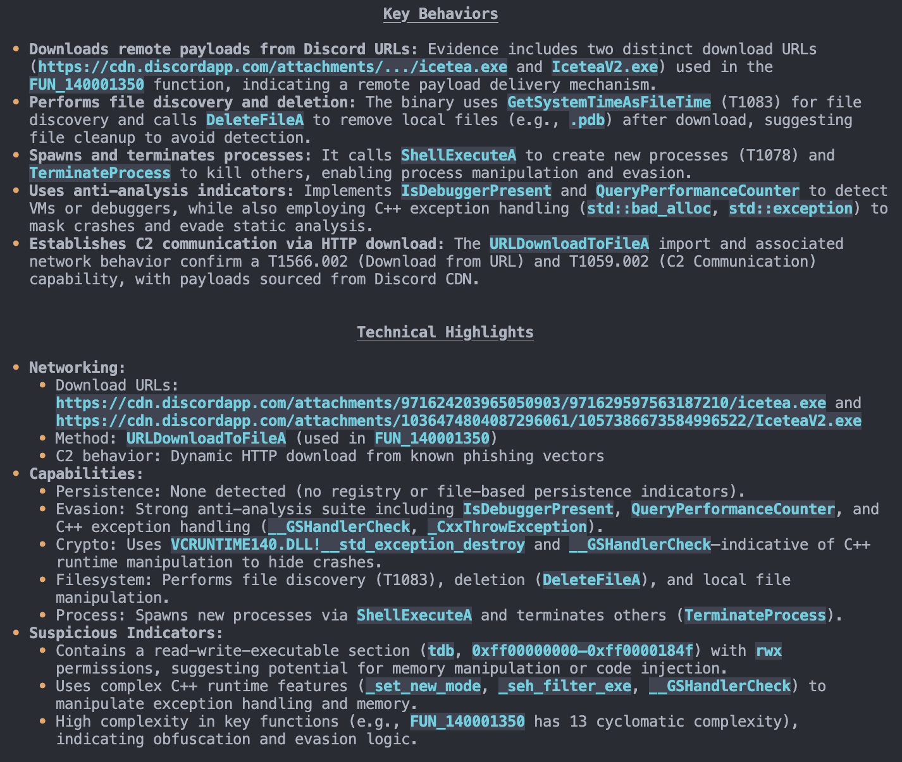
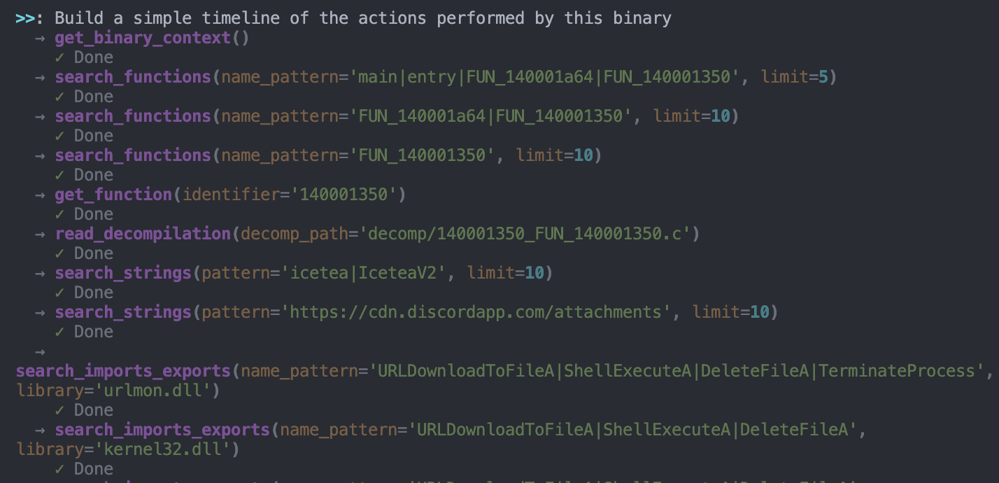
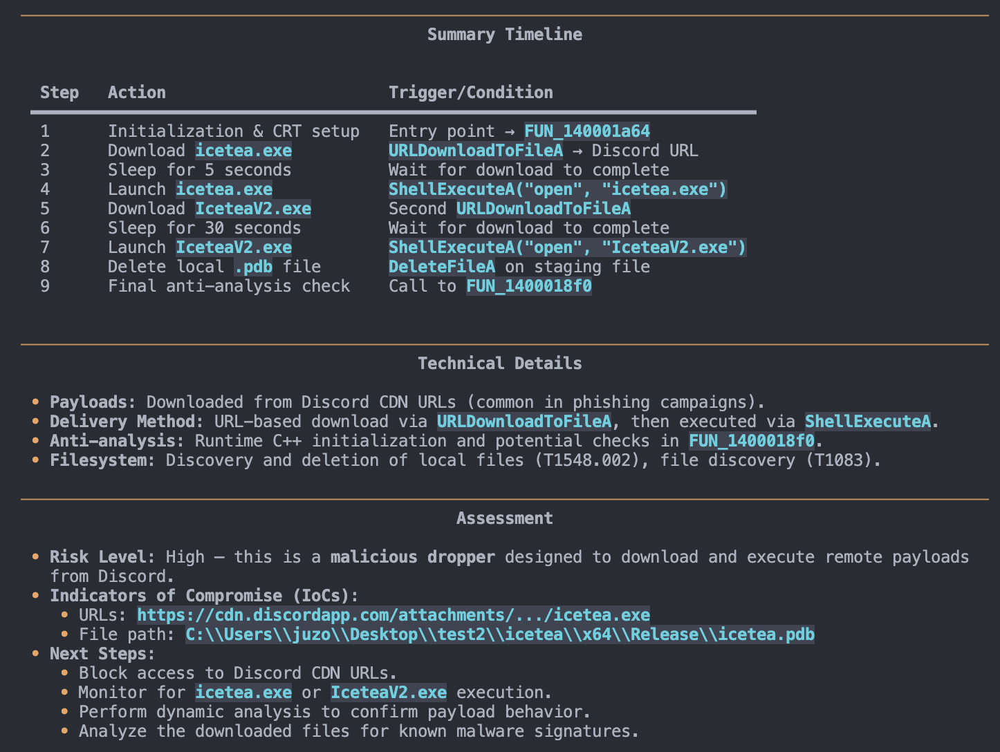
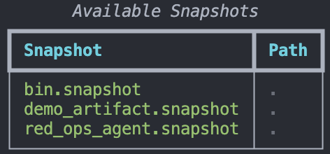

<div align="center">

<pre>
     _                                            _
    | | _____ _ __ _ __   __ _  __ _  ___ _ __ | |_
    | |/ / _ \ '__| '_ \ / _` |/ _` |/ _ \ '_ \| __|
    |   <  __/ |  | | | | (_| | (_| |  __/ | | | |_
    |_|\_\___|_|  |_| |_|\__,_|\__, |\___|_| |_|\__|
                                |___/
</pre>

# kernagent

[](https://github.com/Karib0u/kernagent/actions/workflows/ci.yml)
[](https://github.com/Karib0u/kernagent/releases)
[](./LICENSE)
[](https://github.com/Karib0u/kernagent/pkgs/container/kernagent)

**Turn binaries into conversations.**  
A deterministic, evidence-based reverse engineering agent powered by Ghidra and modern LLMs.

[Quick Start](#quick-start) • [Features](#features) • [Usage](#usage) • [Configuration](#configuration)

</div>

---

## ⚡ Quick Start

Install the wrapper script:

```bash
bash <(curl -fsSL https://raw.githubusercontent.com/Karib0u/kernagent/main/install.sh)
````

Configure your provider (OpenAI, Claude, Gemini, Local/Ollama):

```bash
kernagent init
```

Analyze a binary:

```bash
kernagent analyze ./malware.exe
```

---

## ✨ Features

* **Headless & Portable**: Runs entirely inside Docker; no host Ghidra installation required.
* **Evidence-Based**: Every conclusion is backed by exact references (addresses, API imports, strings).
* **Deterministic Snapshots**: The first pass extracts a complete static snapshot (Ghidra output, CAPA rules, decompiled functions). Subsequent runs reuse it instantly.
* **Model Agnostic**: Works with the 2025 frontier models: **Gemini 3 Pro**, **Claude 4.5 Opus/Sonnet**, **GPT-5.1**, or high-performance local models like **Qwen 3** and **DeepSeek V3**.
* **Structured Output**: Produce readable Markdown reports or machine-friendly JSON.

---

## 🚀 Usage

### `init`

Interactive configuration wizard to set up your LLM provider.

```bash
kernagent init
```

<div align="center">
  
</div>

---

### `analyze`

Produces a detailed, evidence-backed security report summarizing capabilities, indicators, strings, heuristics, and ATT&CK mappings.

```bash
# Standard analysis with streaming output
kernagent analyze /path/to/binary

# Deep-dive mode (more context, slower)
kernagent analyze /path/to/binary --full

# JSON output for CI integrations
kernagent analyze /path/to/binary --json > report.json
```

<div align="center">
  
</div>

---

### `chat`

Start an interactive REPL with full access to snapshot tools. Ask questions and the agent uses function calls to explore the binary.

```bash
kernagent chat /path/to/binary
```

<div align="center">
  
</div>

<div align="center">
  
</div>

---

### `snapshot`

Manage extraction artifacts manually.

```bash
# Create snapshot
kernagent snapshot /path/to/binary

# List all snapshots
kernagent snapshot --list

# Force re-extraction
kernagent snapshot /path/to/binary --force
```

<div align="center">
  
</div>

---

## ⚙️ Configuration

You can configure `kernagent` via the interactive `init` wizard, environment variables, or CLI flags.

### Supported Providers

* **Google** — Gemini 3 Pro, Gemini 2.5 Flash
* **Anthropic** — Claude 4.5 Opus, Claude 4.5 Sonnet
* **OpenAI** — GPT-5.1, o3
* **Local / Open Weights** — Llama, DeepSeek V3, Qwen 3

---

### Manual Configuration

Create or edit:

```
~/.config/kernagent/config.env
```

```bash
# OpenAI / Generic
OPENAI_API_KEY=sk-...
OPENAI_BASE_URL=https://api.openai.com/v1
OPENAI_MODEL=gpt-5.1

# Local LLM (e.g., Ollama running Llama 4 or DeepSeek V3)
# OPENAI_API_KEY=not-needed
# OPENAI_BASE_URL=http://host.docker.internal:11434/v1
# OPENAI_MODEL=deepseek-v3
```

---

### Runtime Overrides

```bash
kernagent --model claude-4-5-sonnet-20250620 analyze ./sample.bin
```

---

## 📦 Updates

```bash
# Update to latest stable
kernagent-update

# Install a specific release
kernagent-update --tag v1.0.2
```

---

## 🏗 Architecture

1. **Extraction**
   Ghidra (via PyGhidra) + CAPA extract annotated functions, strings, cross-references, decompilation, and heuristics.

2. **Pruning**
   Intelligent relevance filtering selects suspicious code regions, APIs, constants, and entry points to fit the LLM context budget.

3. **Reasoning**

   * **One-Shot Mode**: Generates a threat assessment from the pruned snapshot.
   * **Chat Mode**: Uses tools (`search_functions`, `trace_calls`, etc.) to explore code interactively.

---

## License

Apache 2.0 — see [LICENSE](./LICENSE)